# NEXT-AI-MERMAID

<div align="center">

**🎨 基于 AI 的智能 Mermaid 图表生成与编辑工具**

一个现代化的 Web 应用，通过自然语言对话生成和编辑 Mermaid 图表

[功能特性](#✨-功能特性) • [快速开始](#🚀-快速开始) • [技术栈](#🛠️-技术栈) • [使用指南](#📖-使用指南) • [部署](#🌐-部署)

</div>

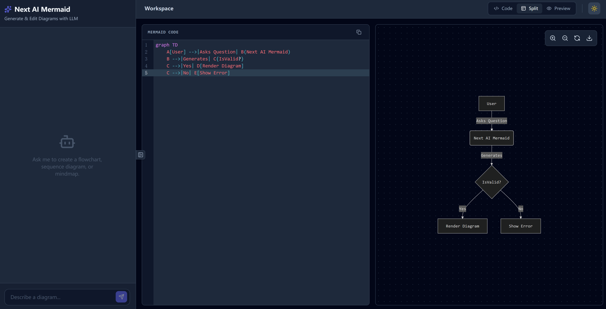
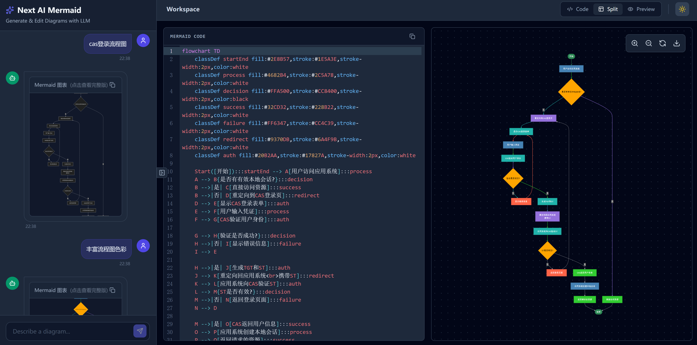
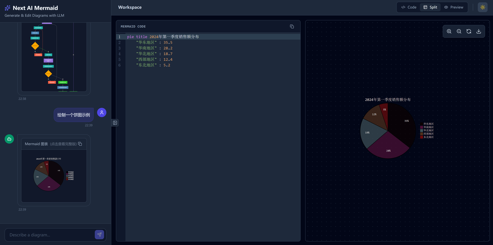

---

## ✨ 功能特性

### 🤖 AI 驱动的图表生成

- **自然语言交互**：通过对话描述需求，AI 自动生成 Mermaid 代码
- **多轮对话支持**：支持连续对话，逐步完善图表
- **智能理解**：理解流程图、序列图、类图、状态图等多种图表类型

### 💬 智能聊天界面

- **实时预览**：聊天框中直接渲染 Mermaid 图表缩略图
- **点击查看**：点击聊天中的图表即可在右侧编辑器中查看完整版
- **多行输入**：支持长文本输入和自动换行（Shift+Enter 换行）
- **历史管理**：保留完整对话历史，随时回看之前的图表

### ✏️ 强大的代码编辑器

- **语法高亮**：专为 Mermaid 语法优化的代码高亮
- **实时验证**：即时检测语法错误并提示
- **自动补全**：智能代码提示和补全
- **主题切换**：支持深色/浅色主题

### 🎯 实时预览

- **即时渲染**：编辑代码时实时更新图表
- **交互操作**：支持缩放、平移、重置视图
- **导出功能**：一键导出 SVG 格式图表
- **响应式布局**：自适应各种屏幕尺寸

### 🎨 优雅的用户界面

- **现代设计**：简洁美观的 UI 设计
- **主题模式**：深色/浅色主题无缝切换
- **视图模式**：支持代码、预览、分屏三种视图
- **无滚动条干扰**：隐藏滚动条，界面更简洁

### 📱 响应式设计

- **移动端适配**：支持手机和平板设备
- **触摸友好**：优化的触摸操作体验
- **自适应布局**：根据屏幕大小自动调整

---

## 🚀 快速开始

### 前提条件

- **Node.js** 18+
- **Python** 3.9+
- **npm** 或 **pnpm**

### 安装步骤

#### 1. 克隆项目

```bash
git clone <repository-url>
cd next-ai-mermaid
```

#### 2. 启动后端服务

```bash
cd backend

# 安装依赖
pip install -r requirements.txt

# 配置环境变量（创建 .env 文件）
# 添加你的 API Key
echo "DEEPSEEK_API_KEY=your_api_key_here" > .env

# 启动服务（默认端口 8000）
python run.py
```

#### 3. 启动前端服务

```bash
cd frontend

# 安装依赖
npm install

# 配置环境变量（创建 .env.local 文件）
echo "VITE_API_URL=http://localhost:8000" > .env.local

# 启动开发服务器（默认端口 3000）
npm run dev
```

#### 4. 访问应用

打开浏览器访问：`http://localhost:3000`

---

## 🛠️ 技术栈

### 前端

- **React 19** - UI 框架
- **TypeScript** - 类型安全
- **Vite** - 构建工具
- **Tailwind CSS** - 样式框架
- **Mermaid.js** - 图表渲染
- **CodeMirror** - 代码编辑器
- **Lucide React** - 图标库

### 后端

- **FastAPI** - Web 框架
- **Python 3.9+** - 编程语言
- **DeepSeek API** - AI 模型
- **Uvicorn** - ASGI 服务器

### 部署

- **Nginx** - 反向代理
- **Systemd** - 进程管理
- **Docker** - 容器化（可选）

---

## 📖 使用指南

### 基础使用

#### 1. 通过对话生成图表

在左侧聊天框输入描述：

```
创建一个用户登录的流程图
```

AI 会自动生成相应的 Mermaid 代码和图表。

#### 2. 多轮对话优化

继续对话来完善图表：

```
添加密码重置功能
```

```
增加二次验证步骤
```

#### 3. 点击查看完整图表

- 聊天框中显示图表缩略图
- **鼠标悬停**查看高亮效果
- **点击图表**在右侧编辑器中查看完整版
- 可以直接编辑和修改代码

#### 4. 手动编辑代码

在代码编辑器中直接编辑 Mermaid 代码：

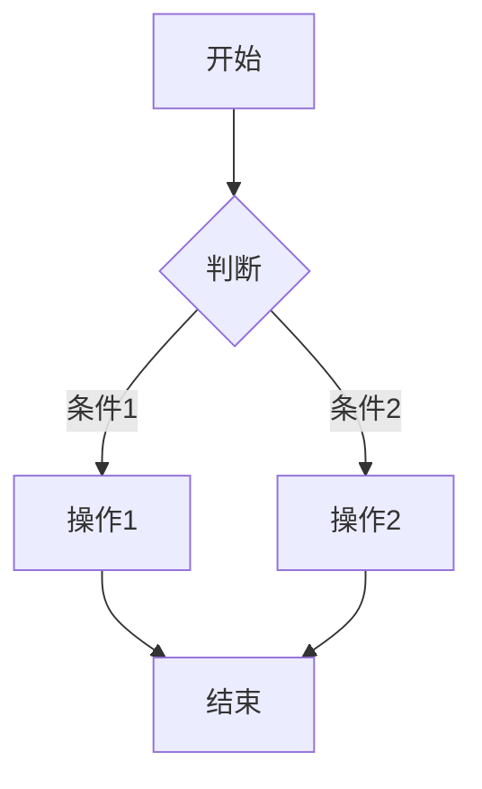

右侧预览会实时更新。

#### 5. 导出图表

点击预览面板右上角的下载按钮，导出 SVG 格式图表。

---

## 🎯 支持的图表类型

### 流程图（Flowchart）

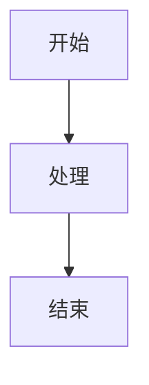

### 序列图（Sequence Diagram）

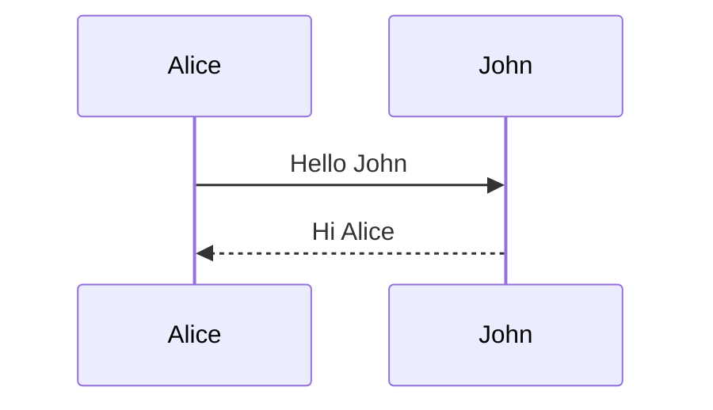

### 类图（Class Diagram）

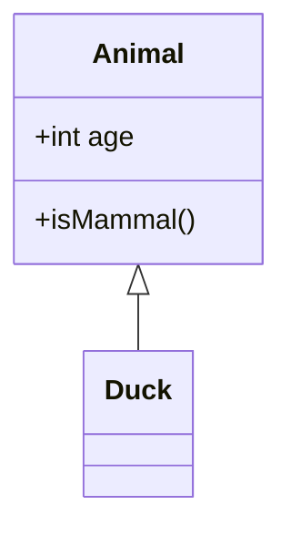

### 状态图（State Diagram）

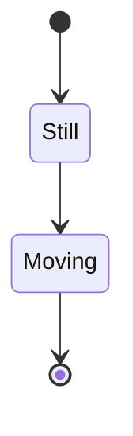

### ER 图（Entity Relationship）

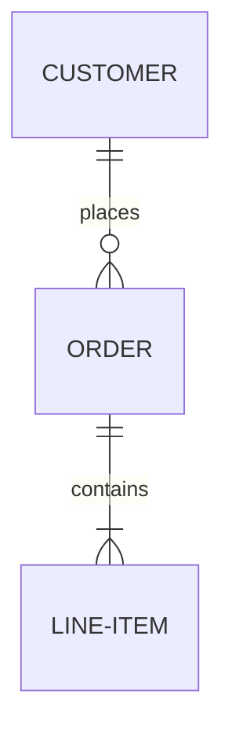

### 甘特图（Gantt Chart）

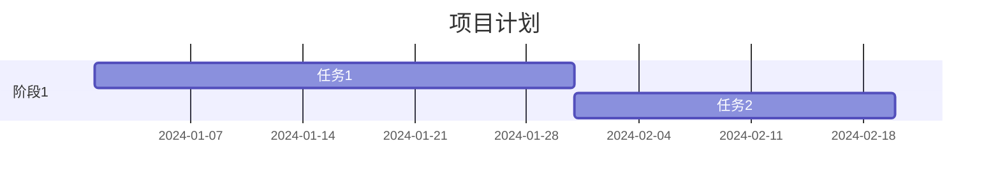

### 饼图（Pie Chart）

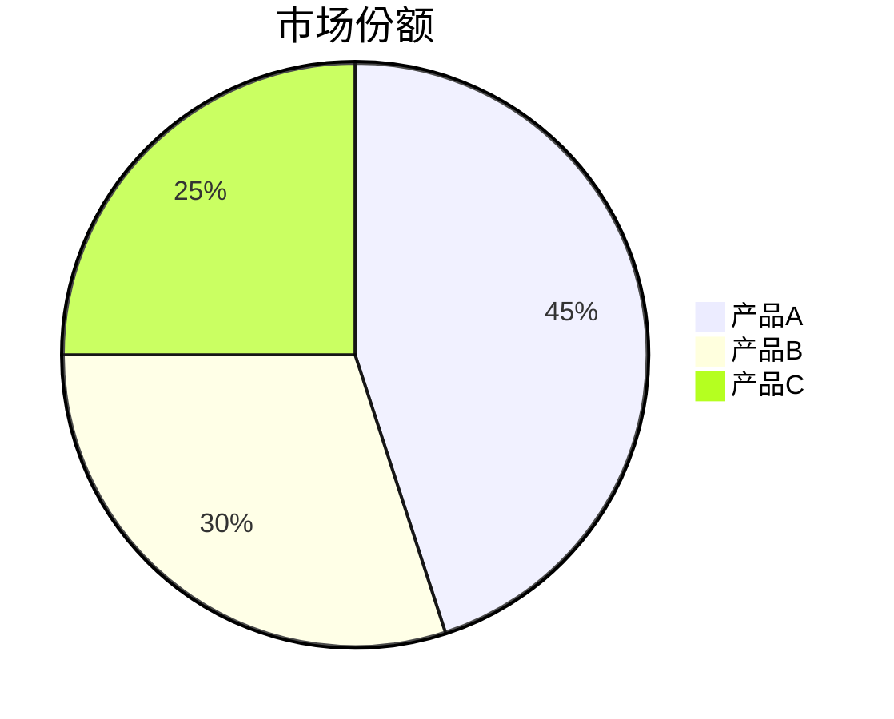

### 思维导图（Mindmap）

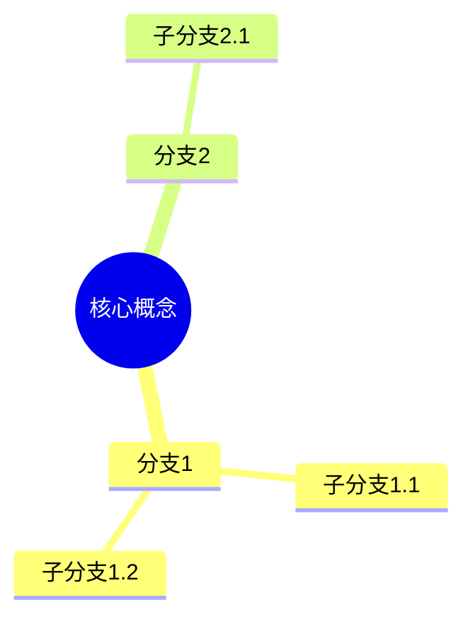

---

## 🎨 界面功能

### 视图模式

- **代码模式**：仅显示代码编辑器
- **预览模式**：仅显示图表预览
- **分屏模式**：同时显示代码和预览（推荐）

### 主题切换

- **深色主题**：适合夜间使用，减少眼睛疲劳
- **浅色主题**：适合白天使用，更明亮清晰

### 聊天面板

- **展开/收起**：点击左侧按钮控制聊天面板显示
- **自动滚动**：新消息自动滚动到底部
- **图表缩略图**：聊天中直接预览图表

---

## ⚙️ 配置说明

### 后端配置（.env）

```env
# API 配置
DEEPSEEK_API_KEY=your_api_key_here
DEEPSEEK_API_BASE=https://api.deepseek.com

# 服务配置
HOST=0.0.0.0
PORT=8000

# CORS 配置
ALLOWED_ORIGINS=http://localhost:3000,http://127.0.0.1:3000
```

### 前端配置（.env.local）

```env
# API 地址
VITE_API_URL=http://localhost:8000

# 应用配置
VITE_APP_TITLE=Next AI Mermaid
```

---

## 🌐 部署

详细的部署指南请参考 [DEPLOYMENT.md](./DEPLOYMENT.md)

### 快速部署

```bash
# 使用部署脚本
chmod +x deploy.sh
./deploy.sh
```

### Docker 部署（推荐）

```bash
# 构建镜像
docker-compose build

# 启动服务
docker-compose up -d
```

---

## 🔧 开发指南

### 项目结构

```
next-ai-mermaid/
├── frontend/                 # 前端项目
│   ├── components/          # React 组件
│   │   ├── ChatInterface.tsx      # 聊天界面
│   │   ├── CodeEditor.tsx         # 代码编辑器
│   │   ├── MermaidRenderer.tsx    # 图表渲染
│   │   └── MessageContent.tsx     # 消息内容渲染
│   ├── contexts/            # React Context
│   ├── services/            # API 服务
│   ├── utils/               # 工具函数
│   ├── types.ts             # TypeScript 类型
│   └── App.tsx              # 主应用组件
├── backend/                 # 后端项目
│   ├── main.py              # FastAPI 主文件
│   ├── services/            # 业务逻辑
│   │   └── ai_service.py    # AI 服务
│   ├── run.py               # 启动脚本
│   └── requirements.txt     # Python 依赖
├── deploy.sh                # 部署脚本
├── nginx.conf               # Nginx 配置
└── README.md                # 项目文档
```

### 开发命令

```bash
# 前端开发
cd frontend
npm run dev          # 启动开发服务器
npm run build        # 构建生产版本
npm run preview      # 预览生产构建

# 后端开发
cd backend
python run.py        # 启动开发服务器
uvicorn main:app --reload  # 热重载模式
```

### 代码规范

- **TypeScript**：使用严格模式
- **Python**：遵循 PEP 8 规范
- **组件**：函数式组件 + Hooks
- **样式**：Tailwind CSS 实用类

---

## 🤝 贡献指南

欢迎贡献代码、报告问题或提出新功能建议！

### 贡献流程

1. Fork 项目
2. 创建特性分支 (`git checkout -b feature/AmazingFeature`)
3. 提交更改 (`git commit -m 'Add some AmazingFeature'`)
4. 推送到分支 (`git push origin feature/AmazingFeature`)
5. 开启 Pull Request

### 报告问题

在 Issues 中描述：

- 问题描述
- 复现步骤
- 预期行为
- 实际行为
- 截图（如有）
- 环境信息

---

## 📝 更新日志

### v1.0.0 (2024-12-18)

#### 新增功能

- ✅ AI 驱动的图表生成
- ✅ 实时代码编辑和预览
- ✅ 聊天框中渲染 Mermaid 图表
- ✅ 点击聊天图表查看完整版
- ✅ 深色/浅色主题切换
- ✅ 多种视图模式
- ✅ 响应式设计
- ✅ 导出 SVG 功能

#### 优化改进

- ✅ 隐藏滚动条，界面更简洁
- ✅ 输入框支持多行换行
- ✅ 优化滚动体验，防止页面抖动
- ✅ 图表缩略图模式
- ✅ Hover 交互反馈

---

## 📄 许可证

本项目采用 MIT 许可证 - 详见 [LICENSE](./LICENSE) 文件

---

## 🙏 致谢

- [Mermaid.js](https://mermaid.js.org/) - 强大的图表渲染库
- [FastAPI](https://fastapi.tiangolo.com/) - 现代化的 Python Web 框架
- [React](https://react.dev/) - 构建用户界面的 JavaScript 库
- [Tailwind CSS](https://tailwindcss.com/) - 实用优先的 CSS 框架
- [DeepSeek](https://www.deepseek.com/) - 提供 AI 能力

---

## 📧 联系方式

如有问题或建议，欢迎联系：

- 提交 Issue
- 发起 Discussion
- 发送邮件

---

<div align="center">

**⭐ 如果这个项目对你有帮助，请给个 Star ⭐**

Made with ❤️ by Next AI Mermaid Team

</div>
