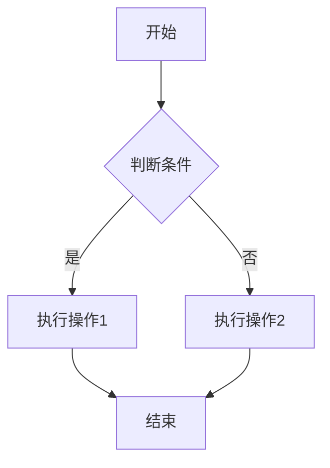
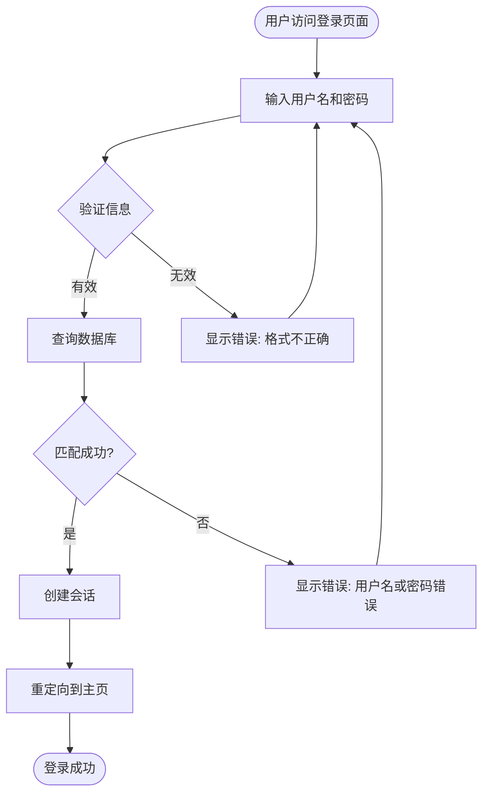

# 聊天框 Mermaid 渲染功能

## 功能说明

现在聊天框中的 LLM 回复支持直接渲染 Mermaid 图表！

### 工作原理

`MessageContent` 组件会自动解析聊天消息中的代码块：

1. **Mermaid 代码块** - 自动渲染成可视化图表
2. **普通代码块** - 显示为带语法高亮的代码
3. **纯文本** - 正常显示

### 使用方法

#### 在聊天中输入 Mermaid 代码

当 AI 返回包含 Mermaid 语法的消息时，会自动渲染。例如：



### 支持的功能

#### 1. 多种图表类型

- 流程图 (flowchart/graph)
- 序列图 (sequenceDiagram)
- 类图 (classDiagram)
- 状态图 (stateDiagram)
- ER 图 (erDiagram)
- 甘特图 (gantt)
- 饼图 (pie)
- 思维导图 (mindmap)
- 等等...

#### 2. 主题适配

- 自动适配深色/浅色主题
- 与应用主题保持一致

#### 3. 代码复制

- 每个代码块都有复制按钮
- 一键复制 Mermaid 代码

#### 4. 错误处理

- 语法错误会显示友好的错误提示
- 不会中断整个聊天界面

### 示例对话

**用户**：请创建一个用户登录的流程图

**AI**：好的，这是用户登录的流程图：



**效果**：上面的 Mermaid 代码会直接渲染成漂亮的流程图！

### 技术实现

#### 组件结构

```
MessageContent.tsx           # 主消息内容解析组件
├── MermaidBlock            # Mermaid 图表渲染子组件
└── CodeBlock               # 普通代码块渲染子组件
```

#### 解析逻辑

1. 使用正则表达式匹配代码块：`` ```language\n...code...\n``` ``
2. 识别语言标记（如 `mermaid`、`javascript`、`python` 等）
3. 根据类型选择合适的渲染器

#### 渲染特性

- **防抖渲染**：避免频繁重绘
- **唯一 ID**：每个图表使用时间戳+随机数生成唯一 ID
- **自适应大小**：图表自动适应容器大小
- **滚动支持**：大图表支持滚动查看

### 样式定制

CSS 样式位于 `frontend/index.css`：

```css
/* 聊天框中的 Mermaid 图表样式优化 */
.mermaid-chat-render svg {
  max-width: 100%;
  height: auto;
}
```

### 性能优化

1. **懒加载渲染**：只渲染可见的图表
2. **内存管理**：自动清理旧的 SVG DOM
3. **错误边界**：单个图表错误不影响其他内容

### 兼容性

- ✅ 支持所有现代浏览器
- ✅ 响应式设计，支持移动设备
- ✅ 支持深色/浅色主题切换

### 未来改进

- [ ] 支持图表导出为 PNG/SVG
- [ ] 支持图表放大/缩小/平移
- [ ] 支持图表编辑模式
- [ ] 支持更多图表库（如 D3.js、ECharts）

## 开发者说明

### 文件位置

- `frontend/components/MessageContent.tsx` - 消息内容渲染组件
- `frontend/components/ChatInterface.tsx` - 聊天界面（已更新使用 MessageContent）
- `frontend/index.css` - 全局样式

### 依赖

- `mermaid` - 图表渲染库
- `lucide-react` - 图标库
- `react` - UI 框架

### 修改记录

1. 创建 `MessageContent` 组件
2. 更新 `ChatInterface` 使用新组件
3. 添加全局 CSS 样式
4. 支持主题切换

